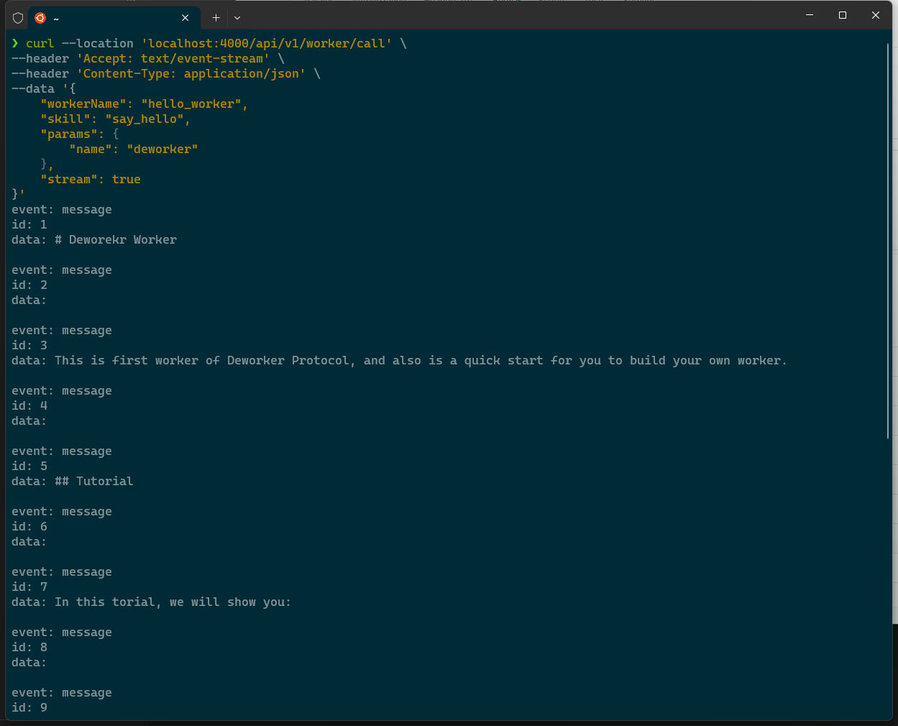
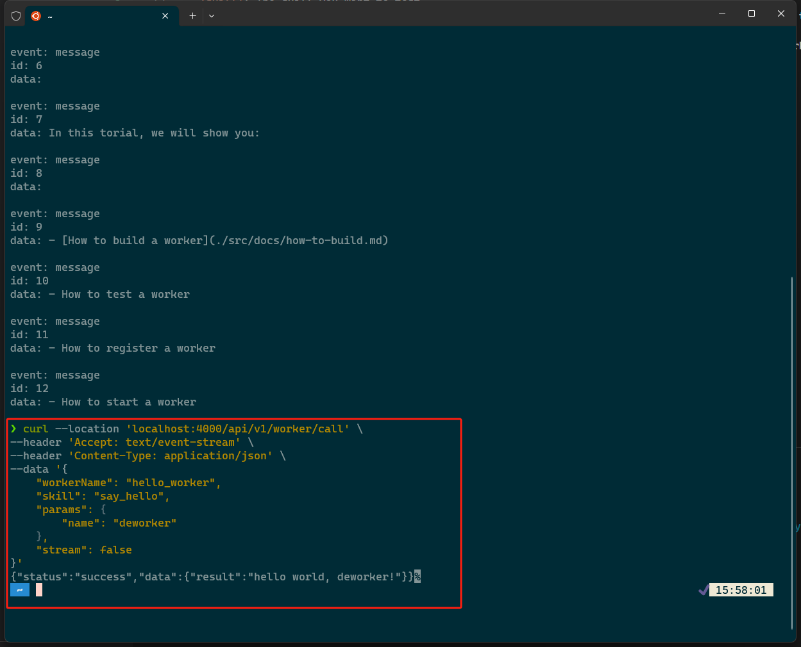

# How to test a worker

After you have built your worker, you will want to test it to ensure that it works as expected. This guide will walk you through the steps to test your worker.

If you have not yet built your worker, please refer to the [How to build a worker](./how-to-build.md) guide.

## Prerequisites

Before you begin, you will need the following:
- [deworker-cli](https://www.npmjs.com/package/@deworker/deworker-cli)
- [curl](https://curl.se/download.html) or [postman](https://www.postman.com/) or some other tool to make HTTP requests

## Let's get started

Before we start testing the worker, we need to start the worker testing service. To start the service, run the following command:

```bash
deworker worker test
```

If the worker testing service is already running, you can skip this step.

If it works, you should see the following output:

```bash
checking whether the entry file exist...
peer started with id 12D3KooWEn7u6ibNgAr6FKDGsRS5kqfYEqe6F2Qp2wuKCyFbcXmF
advertising with a relay address of /ip4/127.0.0.1/tcp/8443/ws/p2p/12D3KooWEn7u6ibNgAr6FKDGsRS5kqfYEqe6F2Qp2wuKCyFbcXmF
listening to port 4000
```

Now that the worker testing service is running, we can test the worker. To test the worker, we will make an HTTP request to the worker testing service. The worker testing service will forward the request to the worker and return the response.

To make an HTTP request to the worker testing service, run the following command:

```bash
curl --location 'localhost:4000/api/v1/worker/call' \
--header 'Accept: text/event-stream' \
--header 'Content-Type: application/json' \
--data '{
    "workerName": "hello_worker",
    "skill": "say_hello",
    "params": {
        "name": "deworker"
    },
    "stream": true
}'
```

- `workerName`: The name of the worker you want to test.
- `skill`: The skill you want to test.
- `params`: The parameters to pass to the skill. You can get more info about the parameters from the - `deworker.yaml` file, see `schema.skills.requestSchema`.
- `stream`: If set to `true`, the worker will return a stream of data. If set to `false`, the worker will return a json content response.

If the worker is working as expected, you should see the following output:



If you see the output above, congratulations! You have successfully tested your worker.

As you can see the stream is true, let's see how to test the worker with stream false.

To test the worker with stream false, run the following command:

```bash
curl --location 'localhost:4000/api/v1/worker/call' \
--header 'Accept: text/event-stream' \
--header 'Content-Type: application/json' \
--data '{
    "workerName": "hello_worker",
    "skill": "say_hello",
    "params": {
        "name": "deworker"
    },
    "stream": false
}'
```

Only difference is the stream is set to false.

If the worker is working as expected, you should see the following output:



Now you can try to register your worker to Deworker Protocol. Read more here: [How to register a worker](./how-to-register.md).